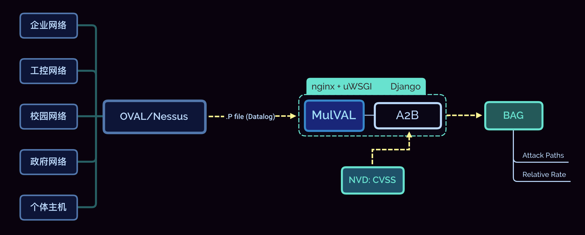

# BAG_MulVAL
BAG-MulVAL: an auxiliary analysis tool of intranet security based on MulVAL attack graph.

Django Project

***

## 项目整体结构

### 项目结构图

### 目标网络与OVAL扫描器模块

本模块不属于本项目 $web$ 应用 _BAG-MulVAL​_，但是是 ​_BAG-MulVAL_ 的输入来源。首先使用 $Nessus$ 等 _OVAL​_ （开放式漏洞评估语言）扫描器对要分析的各种网络进行扫描。扫描得到的信息越多，最后的分析越充分完整。将扫描得到的网络配置信息、漏洞信息、主机互连信息写成 $Datalog$ 的事实和结果语句[^1]，即 $.P$ 文件，通过网络传输到 _BAG-MulVAL_ $web$ 应用上进行分析。

### web 应用模块

$web$ 应用包含两个模块，即 **MulVAL** 和 **A2B**。

#### MulVAL 模块

接收到 $.P$ 文件后，先调用 **MulVAL** 生成初始的属性攻击图与其 $XML$ 文件。

#### A2B 模块

调用 **A2B** 模块解析攻击图的 $XML$ 文件，分析并处理攻击图；同时通过爬虫爬取到的 _NVD​ CVSS_ 信息查询攻击图中所有漏洞的各项 _CVSS​_ 评分，用于计算各攻击路径的**贝叶斯概率**。

最后调用 $Python$ 库 $Graphviz$ 生成可视化贝叶斯攻击图，包含**可能的攻击路径**及**路径对应的相对攻击成功概率**。
